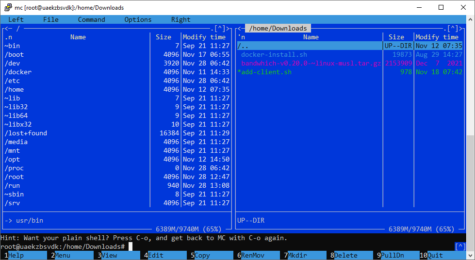
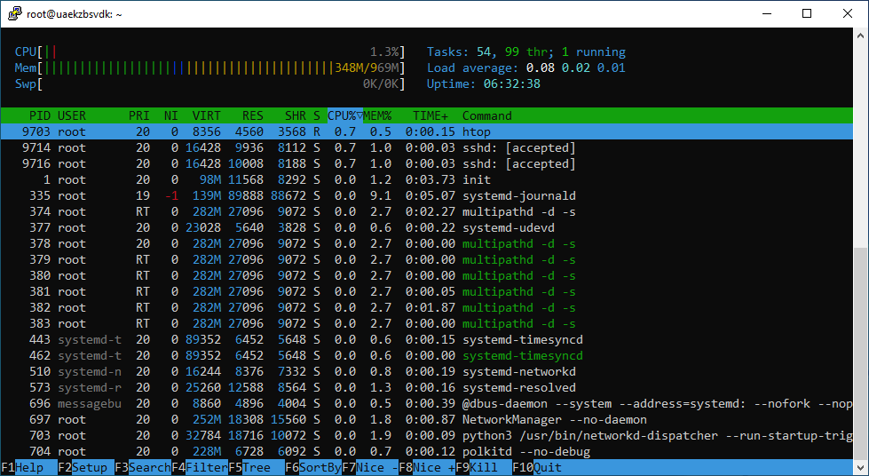
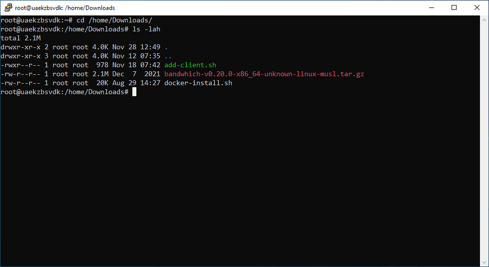
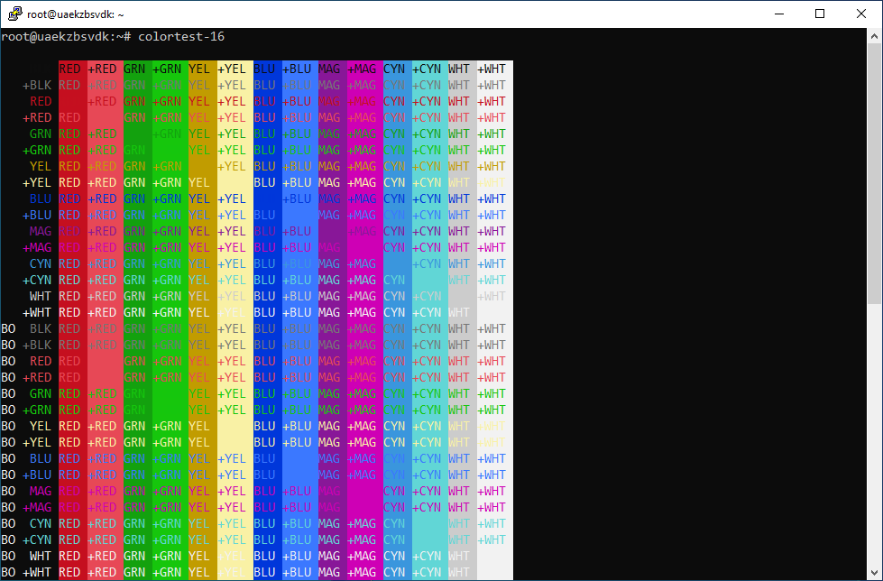
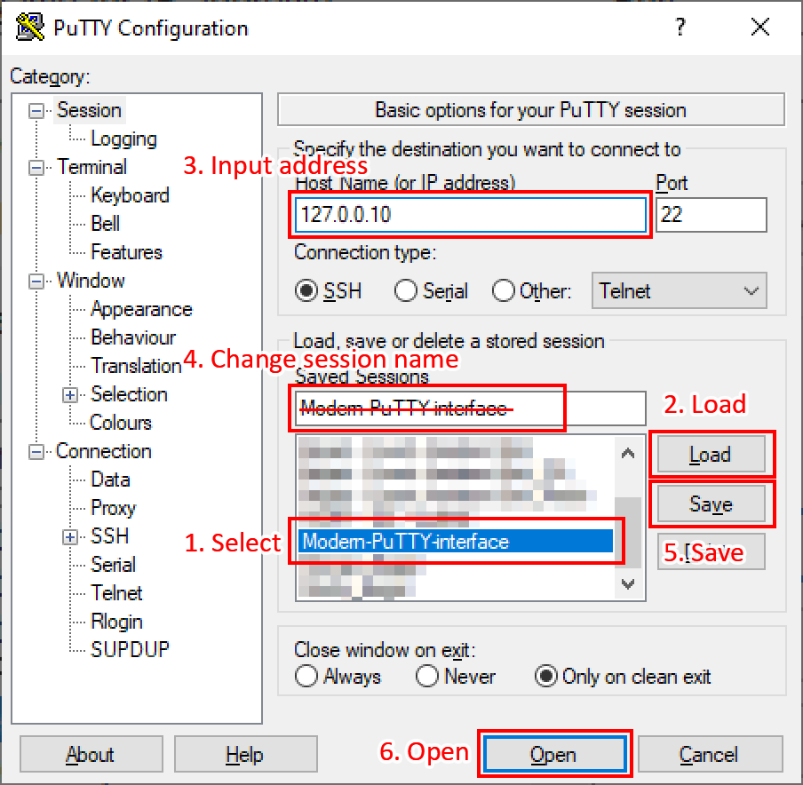

# Modern PuTTY terminal interface

## How to install
1. Download [Modern-PuTTY-interface.reg](https://raw.githubusercontent.com/Andrej3000/Modern-PuTTY-interface/main/Modern-PuTTY-interface.reg)
2. Double-click on the downloaded file and confirm on warnings.

and ...

## Features
* Consolas 11pt ClearType font
* Scrollback buffer set to 2000 lines
* Seconds between keepalives set to 59
* Mouse pointer hides while typing
* Initial window size set to 120 x 28
* Window border set to 0 px
* Alert on window close disable

## Thanks
* to Jacek Trociński [pretty-putty](https://github.com/jacektrocinski).